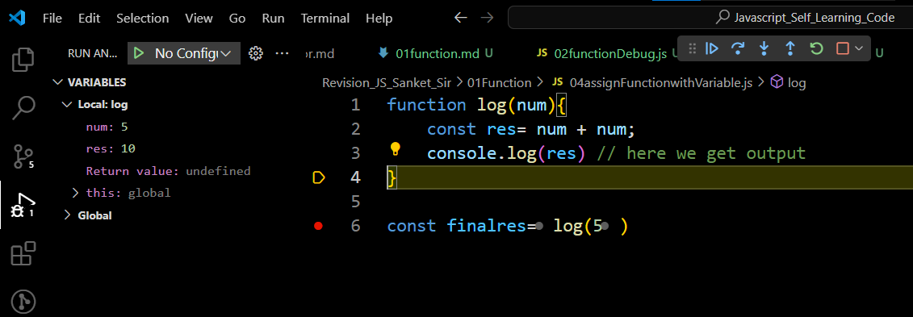

# In Js is not mandatory to write return but when do not define return so its will return "undefined"

## Instead of return through if we console inside the function so if we storing function in any variable we will get undefined

```javascript
function log(num) {
  const res = num + num;
  console.log(res); // here we get output
}
log(5); // we will get desired output but return will undefined
```

## if want to store function final outcome any variable we have return final outcome too

```javascript
function log(num) {
  const res = num + num;
  console.log(res); // here we get output
}
const finalres = log(5);
```

## after assign function call in new variable return will undefined because we didnot added return



# Two way get return value

## 1. function assigned in Variable

```javascript
const result = function (a, b, c) {
  return a + b + c;
};

console.log(result(5, 6, 7));
```

## 2 Function argument assigned in variable

```javascript
function add(a, b, c) {
  return a + b + c;
}
const result = add(87, 20, 12);
console.log(result);
```

# arguments

```javascript
function fun()
{
    let sum=0;
    console.log(arguments.length)
for(let i=0;i<arguments.length;i++){
sum=sum+arguments[i]
}
return sum;
}

const finalSum=fun(4,5,6)
console.log(finalSum)

```
## break-down
```javascript
for(let i=0;i<arguments.length;i++){
sum=sum+arguments[i]
}

```
let i =0 because array indexing from 0 

                  1 2 3
arguments.length (4,5,6)

# why i < arguments.length ?
## Because indexing start with 0 so its will 0 1 2 indexes and arguments.length will 3 so we have stop at 2 index because our last element at 2 so its will less than argument.length that is " 3 "